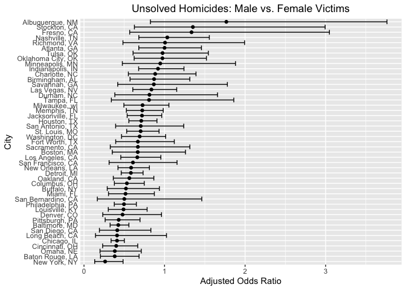
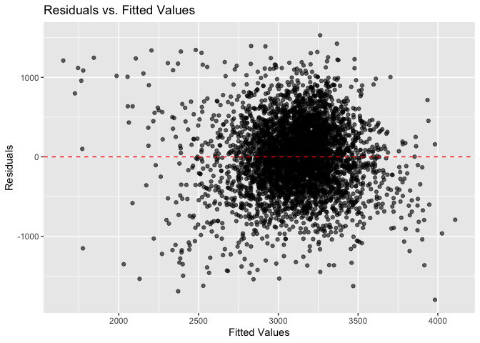
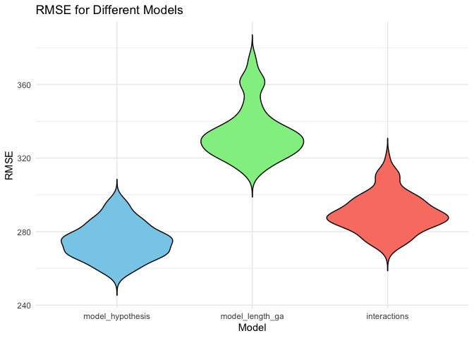

p8105_hw6_gp2770
================
Gokul Pareek
2024-11-19

I’m an R Markdown document!

``` r
library(tidyverse)
```

    ## ── Attaching core tidyverse packages ──────────────────────── tidyverse 2.0.0 ──
    ## ✔ dplyr     1.1.4     ✔ readr     2.1.5
    ## ✔ forcats   1.0.0     ✔ stringr   1.5.1
    ## ✔ ggplot2   3.5.1     ✔ tibble    3.2.1
    ## ✔ lubridate 1.9.3     ✔ tidyr     1.3.1
    ## ✔ purrr     1.0.2     
    ## ── Conflicts ────────────────────────────────────────── tidyverse_conflicts() ──
    ## ✖ dplyr::filter() masks stats::filter()
    ## ✖ dplyr::lag()    masks stats::lag()
    ## ℹ Use the conflicted package (<http://conflicted.r-lib.org/>) to force all conflicts to become errors

``` r
library(broom)
```

# Problem 1

## Data Generation

``` r
weather_df = 
  rnoaa::meteo_pull_monitors(
    c("USW00094728"),
    var = c("PRCP", "TMIN", "TMAX"), 
    date_min = "2017-01-01",
    date_max = "2017-12-31") %>%
  mutate(
    name = recode(id, USW00094728 = "CentralPark_NY"),
    tmin = tmin / 10,
    tmax = tmax / 10) %>%
  select(name, id, everything())
```

    ## using cached file: /Users/gokulpareek/Library/Caches/org.R-project.R/R/rnoaa/noaa_ghcnd/USW00094728.dly

    ## date created (size, mb): 2024-11-18 20:36:26.774993 (8.667)

    ## file min/max dates: 1869-01-01 / 2024-11-30

## Bootstrap Analysis

``` r
set.seed(123)

# Function to compute R^2 and log(beta0 * beta1)
compute_metrics <- function(data) {
  model <- lm(tmax ~ tmin, data = data)
  r_squared <- glance(model)$r.squared
  coefs <- tidy(model)
  log_beta_product <- log(coefs$estimate[1] * coefs$estimate[2])
  c(r_squared, log_beta_product)
}

# Perform bootstrap
n_boot <- 5000
bootstrap_results <- replicate(n_boot, {
  sample_data <- weather_df %>% slice_sample(n = nrow(weather_df), replace = TRUE)
  compute_metrics(sample_data)
}, simplify = "matrix")

# Convert to a tidy data frame
bootstrap_df <- as.data.frame(t(bootstrap_results))
colnames(bootstrap_df) <- c("r_squared", "log_beta_product")
```

# Problem 2

``` r
library(purrr)
```

## Loading and Modifying the Data

``` r
homicide_df <- read_csv("data/homicide-data.csv", na = c("", "NA", "Unknown")) %>%
  # Clean column names for consistency
  janitor::clean_names() %>% 
  
  # Combine city and state into one column
  unite(city_state, c(city, state), sep = ", ") %>%
  
  # Filter out specific cities and keep only relevant races and valid ages
  filter(
    !city_state %in% c("Dallas, TX", "Phoenix, AZ", "Kansas City, MO", "Tulsa, AL"),
    victim_race %in% c("White", "Black"),
    victim_age != "Unknown"
  ) %>%
  
  # Convert victim_age to numeric and create a resolved column as a binary indicator
  mutate(
    victim_age = as.numeric(victim_age),
    resolved = as.numeric(disposition == "Closed by arrest"),
    # Reorder levels in victim_race, prioritizing "White"
    victim_race = fct_relevel(victim_race, "White")
  ) %>%
  
  # Select only relevant columns for analysis
  select(city_state, resolved, victim_age, victim_race, victim_sex)
```

    ## Rows: 52179 Columns: 12
    ## ── Column specification ────────────────────────────────────────────────────────
    ## Delimiter: ","
    ## chr (8): uid, victim_last, victim_first, victim_race, victim_sex, city, stat...
    ## dbl (4): reported_date, victim_age, lat, lon
    ## 
    ## ℹ Use `spec()` to retrieve the full column specification for this data.
    ## ℹ Specify the column types or set `show_col_types = FALSE` to quiet this message.

## Logistic Regression for Baltimore, MD

``` r
logistic_model <- 
  homicide_df %>% 
  filter(city_state == "Baltimore, MD") %>% 
  glm(resolved ~ victim_age + victim_sex + victim_race, data = ., family = binomial())

broom::tidy(logistic_model, conf.int = TRUE) %>% mutate(OR = exp(estimate), 
                                                  conf_low = exp(conf.low), 
                                                  conf_high = exp(conf.high)) %>% 
  select(term, log_OR = estimate, OR, conf_low, conf_high) %>% filter(term == "victim_sexMale") %>% 
  knitr::kable(digits = 4)
```

| term           |  log_OR |     OR | conf_low | conf_high |
|:---------------|--------:|-------:|---------:|----------:|
| victim_sexMale | -0.8545 | 0.4255 |   0.3242 |    0.5576 |

## Logistic Regression for Each of the Cities

``` r
city_results <- homicide_df %>%
  group_by(city_state) %>%
  nest() %>%
  mutate(
    model = map(data, ~glm(resolved ~ victim_age + victim_sex + victim_race, data = ., family = "binomial")),
    results = map(model, broom::tidy, conf.int = TRUE)) %>%
  unnest(results) %>%
  mutate(OR = exp(estimate), 
         conf_low = exp(conf.low), conf_high = exp(conf.high)) %>% 
  select(city_state, term, OR, conf_low, conf_high) %>%
   filter(term == "victim_sexMale") 

city_results %>% knitr::kable(digits = 4)
```

| city_state         | term           |     OR | conf_low | conf_high |
|:-------------------|:---------------|-------:|---------:|----------:|
| Albuquerque, NM    | victim_sexMale | 1.7675 |   0.8247 |    3.7619 |
| Atlanta, GA        | victim_sexMale | 1.0001 |   0.6803 |    1.4583 |
| Baltimore, MD      | victim_sexMale | 0.4255 |   0.3242 |    0.5576 |
| Baton Rouge, LA    | victim_sexMale | 0.3814 |   0.2043 |    0.6836 |
| Birmingham, AL     | victim_sexMale | 0.8700 |   0.5714 |    1.3138 |
| Boston, MA         | victim_sexMale | 0.6673 |   0.3508 |    1.2600 |
| Buffalo, NY        | victim_sexMale | 0.5206 |   0.2884 |    0.9358 |
| Charlotte, NC      | victim_sexMale | 0.8839 |   0.5507 |    1.3906 |
| Chicago, IL        | victim_sexMale | 0.4101 |   0.3361 |    0.5009 |
| Cincinnati, OH     | victim_sexMale | 0.3998 |   0.2314 |    0.6670 |
| Columbus, OH       | victim_sexMale | 0.5325 |   0.3770 |    0.7479 |
| Denver, CO         | victim_sexMale | 0.4791 |   0.2327 |    0.9625 |
| Detroit, MI        | victim_sexMale | 0.5823 |   0.4619 |    0.7335 |
| Durham, NC         | victim_sexMale | 0.8124 |   0.3824 |    1.6580 |
| Fort Worth, TX     | victim_sexMale | 0.6690 |   0.3935 |    1.1212 |
| Fresno, CA         | victim_sexMale | 1.3352 |   0.5673 |    3.0475 |
| Houston, TX        | victim_sexMale | 0.7110 |   0.5570 |    0.9057 |
| Indianapolis, IN   | victim_sexMale | 0.9187 |   0.6785 |    1.2413 |
| Jacksonville, FL   | victim_sexMale | 0.7198 |   0.5359 |    0.9651 |
| Las Vegas, NV      | victim_sexMale | 0.8373 |   0.6059 |    1.1511 |
| Long Beach, CA     | victim_sexMale | 0.4102 |   0.1427 |    1.0242 |
| Los Angeles, CA    | victim_sexMale | 0.6619 |   0.4565 |    0.9541 |
| Louisville, KY     | victim_sexMale | 0.4906 |   0.3015 |    0.7836 |
| Memphis, TN        | victim_sexMale | 0.7232 |   0.5261 |    0.9836 |
| Miami, FL          | victim_sexMale | 0.5152 |   0.3040 |    0.8734 |
| Milwaukee, wI      | victim_sexMale | 0.7271 |   0.4951 |    1.0542 |
| Minneapolis, MN    | victim_sexMale | 0.9470 |   0.4759 |    1.8810 |
| Nashville, TN      | victim_sexMale | 1.0342 |   0.6807 |    1.5560 |
| New Orleans, LA    | victim_sexMale | 0.5849 |   0.4219 |    0.8122 |
| New York, NY       | victim_sexMale | 0.2624 |   0.1328 |    0.4850 |
| Oakland, CA        | victim_sexMale | 0.5631 |   0.3637 |    0.8671 |
| Oklahoma City, OK  | victim_sexMale | 0.9741 |   0.6229 |    1.5200 |
| Omaha, NE          | victim_sexMale | 0.3825 |   0.1988 |    0.7109 |
| Philadelphia, PA   | victim_sexMale | 0.4963 |   0.3760 |    0.6499 |
| Pittsburgh, PA     | victim_sexMale | 0.4308 |   0.2626 |    0.6956 |
| Richmond, VA       | victim_sexMale | 1.0061 |   0.4835 |    1.9936 |
| San Antonio, TX    | victim_sexMale | 0.7046 |   0.3928 |    1.2383 |
| Sacramento, CA     | victim_sexMale | 0.6688 |   0.3263 |    1.3144 |
| Savannah, GA       | victim_sexMale | 0.8670 |   0.4186 |    1.7802 |
| San Bernardino, CA | victim_sexMale | 0.5003 |   0.1655 |    1.4624 |
| San Diego, CA      | victim_sexMale | 0.4130 |   0.1914 |    0.8302 |
| San Francisco, CA  | victim_sexMale | 0.6075 |   0.3117 |    1.1551 |
| St. Louis, MO      | victim_sexMale | 0.7032 |   0.5299 |    0.9319 |
| Stockton, CA       | victim_sexMale | 1.3517 |   0.6256 |    2.9941 |
| Tampa, FL          | victim_sexMale | 0.8077 |   0.3395 |    1.8599 |
| Tulsa, OK          | victim_sexMale | 0.9758 |   0.6091 |    1.5439 |
| Washington, DC     | victim_sexMale | 0.6910 |   0.4660 |    1.0135 |

## Plotting

``` r
city_results %>% 
  ggplot(aes(y = reorder(city_state, OR), x = OR)) +  # Cities on y-axis, OR on x-axis
  geom_point() +
  geom_errorbar(aes(xmin = conf_low, xmax = conf_high)) +  # Error bars for x-axis
  labs(
    title = "Unsolved Homicides: Male vs. Female Victims",
    y = "City",  # Reflects swapped axes
    x = "Adjusted Odds Ratio"
  ) +
  theme(
    axis.text.y = element_text(vjust = 0.5, margin = margin(t = 5, b = 5)),  # Adds spacing around labels
    axis.ticks.y = element_blank(),  # Optional: hides y-axis ticks for a cleaner look
    axis.text.x = element_text(angle = 0),  # Keeps x-axis text readable
    plot.title = element_text(hjust = 0.5)  # Centers the title
  )
```

<!-- -->

# Problem 3

## Loading and Cleaning the Data

``` r
library(modelr)
```

    ## 
    ## Attaching package: 'modelr'

    ## The following object is masked from 'package:broom':
    ## 
    ##     bootstrap

``` r
# Load the dataset
birthweight_data <- read.csv("data/birthweight.csv")

# Correct column name typo
colnames(birthweight_data)[colnames(birthweight_data) == "mheigth"] <- "mheight"

# Convert numeric columns to factors where appropriate
birthweight_data <- birthweight_data %>%
  mutate(
    babysex = factor(babysex, levels = c(1, 2), labels = c("Male", "Female")),
    frace = factor(frace, levels = c(1, 2, 3, 4, 8), 
                   labels = c("White", "Black", "Asian", "Puerto Rican", "Other")),
    malform = factor(malform, levels = c(0, 1), labels = c("Absent", "Present")),
    mrace = factor(mrace, levels = c(1, 2, 3, 4), 
                   labels = c("White", "Black", "Asian", "Puerto Rican"))
  )

# Check for missing data
missing_data_summary <- birthweight_data %>%
  summarize(across(everything(), ~ sum(is.na(.))))

# Display structure of the dataset to confirm changes
glimpse(birthweight_data)
```

    ## Rows: 4,342
    ## Columns: 20
    ## $ babysex  <fct> Female, Male, Female, Male, Female, Male, Female, Female, Mal…
    ## $ bhead    <int> 34, 34, 36, 34, 34, 33, 33, 33, 36, 33, 35, 35, 35, 36, 35, 3…
    ## $ blength  <int> 51, 48, 50, 52, 52, 52, 46, 49, 52, 50, 51, 51, 48, 53, 51, 4…
    ## $ bwt      <int> 3629, 3062, 3345, 3062, 3374, 3374, 2523, 2778, 3515, 3459, 3…
    ## $ delwt    <int> 177, 156, 148, 157, 156, 129, 126, 140, 146, 169, 130, 146, 1…
    ## $ fincome  <int> 35, 65, 85, 55, 5, 55, 96, 5, 85, 75, 55, 55, 75, 75, 65, 75,…
    ## $ frace    <fct> White, Black, White, White, White, White, Black, White, White…
    ## $ gaweeks  <dbl> 39.9, 25.9, 39.9, 40.0, 41.6, 40.7, 40.3, 37.4, 40.3, 40.7, 4…
    ## $ malform  <fct> Absent, Absent, Absent, Absent, Absent, Absent, Absent, Absen…
    ## $ menarche <int> 13, 14, 12, 14, 13, 12, 14, 12, 11, 12, 13, 12, 13, 11, 12, 1…
    ## $ mheight  <int> 63, 65, 64, 64, 66, 66, 72, 62, 61, 64, 67, 62, 64, 68, 62, 6…
    ## $ momage   <int> 36, 25, 29, 18, 20, 23, 29, 19, 13, 19, 23, 16, 28, 23, 21, 1…
    ## $ mrace    <fct> White, Black, White, White, White, White, Black, White, White…
    ## $ parity   <int> 3, 0, 0, 0, 0, 0, 0, 0, 0, 0, 0, 0, 0, 0, 0, 0, 0, 0, 0, 0, 0…
    ## $ pnumlbw  <int> 0, 0, 0, 0, 0, 0, 0, 0, 0, 0, 0, 0, 0, 0, 0, 0, 0, 0, 0, 0, 0…
    ## $ pnumsga  <int> 0, 0, 0, 0, 0, 0, 0, 0, 0, 0, 0, 0, 0, 0, 0, 0, 0, 0, 0, 0, 0…
    ## $ ppbmi    <dbl> 26.27184, 21.34485, 23.56517, 21.84508, 21.02642, 18.60030, 1…
    ## $ ppwt     <int> 148, 128, 137, 127, 130, 115, 105, 119, 105, 145, 110, 115, 1…
    ## $ smoken   <dbl> 0.000, 0.000, 1.000, 10.000, 1.000, 0.000, 0.000, 0.000, 0.00…
    ## $ wtgain   <int> 29, 28, 11, 30, 26, 14, 21, 21, 41, 24, 20, 31, 23, 21, 24, 2…

## Proposing a Regression Model for Birthweight

Using hypothesized key predictors for birthweight: 1. Mother’s weight
(delivery weight, pre-pregnancy BMI) 2. Gestational age 3. Smoking
during pregnancy 4. Baby’s sex 5. Presence of malformations

``` r
# Fit a hypothesized model
model_hypothesis <- lm(bwt ~ delwt + gaweeks + smoken + babysex + malform, data = birthweight_data)

# Add predictions and residuals to the dataset
birthweight_data <- birthweight_data %>%
  add_predictions(model_hypothesis, var = "predicted_bwt") %>%
  add_residuals(model_hypothesis, var = "residuals")

# Plot residuals vs. fitted values
ggplot(birthweight_data, aes(x = predicted_bwt, y = residuals)) +
  geom_point(alpha = 0.6) +
  geom_hline(yintercept = 0, color = "red", linetype = "dashed") +
  labs(title = "Residuals vs. Fitted Values", x = "Fitted Values", y = "Residuals")
```

<!-- -->

## Comparing Models

### Model 1: Length At Birth and Gestational Age

``` r
model_length_ga <- lm(bwt ~ blength + gaweeks, data = birthweight_data)
```

### Model 2: Full Interaction Model

``` r
model_interactions <- lm(bwt ~ bhead * blength * babysex, data = birthweight_data)
```

### Cross-Validation for Comparison

``` r
library(purrr)

cv_df <- 
  crossv_mc(birthweight_data, 100) %>% 
  mutate(
    train = map(train, as_tibble), 
    test = map(test, as_tibble)
  ) %>% 
  mutate(model_hypothesis = map(train, \(df) lm(bwt~ babysex + bhead + blength + delwt + gaweeks + mrace + parity + smoken, data = df)),
    model_length_ga = map(train, \(df) lm(bwt ~ blength + gaweeks, data = df)), 
         model_interactions = map(train, \(df) lm(bwt ~ bhead + blength + babysex + bhead*blength*babysex, data = df))) %>% 
  mutate(
    rmse_model_hypothesis = map2_dbl(model_hypothesis, test, \(mod, df) rmse(model = mod, data = df)), 
    rmse_model_length_ga = map2_dbl(model_length_ga, test, \(mod, df) rmse(model = mod, data = df)), 
    rmse_interactions = map2_dbl(model_interactions, test, \(mod, df) rmse(model = mod, data = df))
  )
```

    ## Warning: There were 3 warnings in `mutate()`.
    ## The first warning was:
    ## ℹ In argument: `rmse_model_hypothesis = map2_dbl(...)`.
    ## Caused by warning in `predict.lm()`:
    ## ! prediction from rank-deficient fit; attr(*, "non-estim") has doubtful cases
    ## ℹ Run `dplyr::last_dplyr_warnings()` to see the 2 remaining warnings.

``` r
cv_df %>% 
  select(starts_with("rmse")) %>% 
  pivot_longer(everything(), 
               names_to = "model", 
               values_to = "rmse", 
               names_prefix = "rmse_") %>% 
  mutate(model = fct_inorder(model)) %>% 
  ggplot(aes(x = model, y = rmse, fill = model)) + 
  geom_violin(trim = FALSE, color = "black") +
  scale_fill_manual(values = c("skyblue", "lightgreen", "salmon")) + # Custom colors
  theme_minimal() +
  labs(title = "RMSE for Different Models",
       x = "Model",
       y = "RMSE") +
  theme(legend.position = "none")
```

<!-- -->
